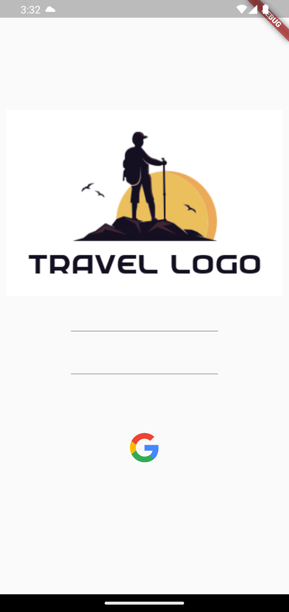
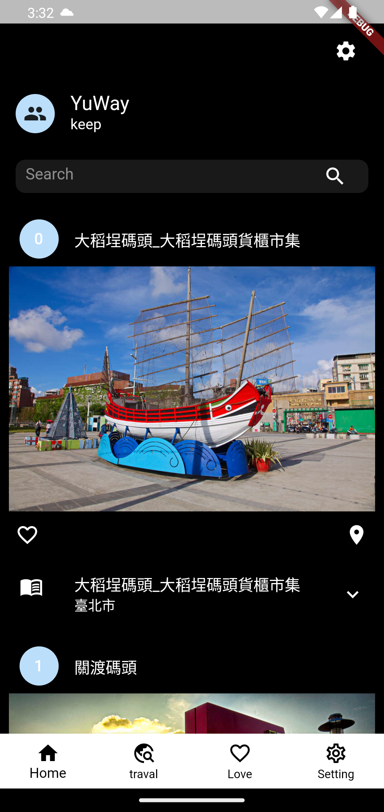
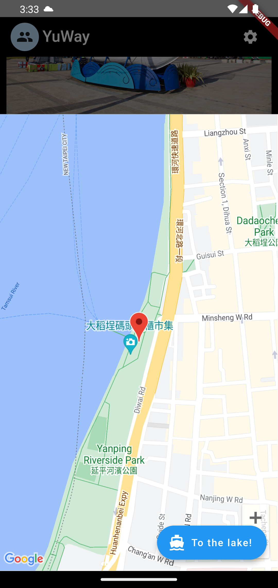
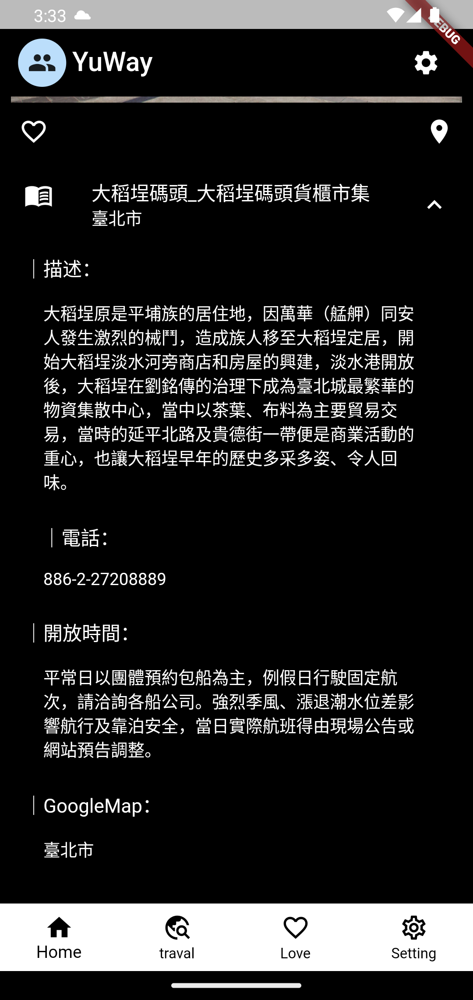

# travel Taiwan

- A new Flutter side project that learn design pattern.
- flutter that learns to design patterns and API、SQL、StateManagement.
- All images are quoted.

### Google Map / Firebase auth / Google OAuth2.0

